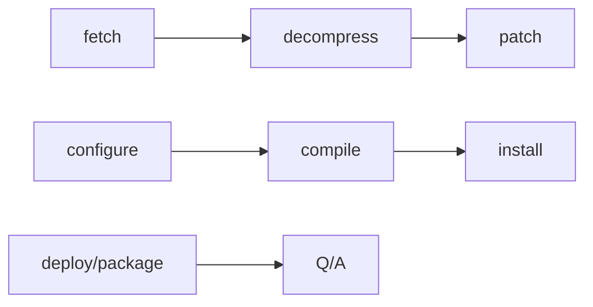

# Recipes




A simple recipe for cooking a software package that has only one c file.
```python
# description of package
DESCRIPTION = "${PN} file receipe"
# category of package
SECTION = "base"
# license of package (required)
LICENSE = "CLOSED" # can be MIT, GPLv2, etc.
LIC_FILES_CHKSUM = "file://${WORKDIR}/COPYRIGHT;md5=349c872e0066155e818b786938876a4"

'''
Do not need to define these in receipe body. 
we can just name the file helloworldc_1.0.0.bb
In this case, helloworldc will be assigned to the package name and 1.0.0 will be assigned to the package version. 
'''
# package name
PN = "helloworldc"
# package version
PV = "1.0.0"
# package revision
PR = "r0"

# used to include any file in the WORKDIR. 
'''
Can specify a list of any containing folders, c files, archives, patch files, kernel config files

Can also include git repos and tarballs here.
If you give a git repo then the repo will be cloned under the workdir to a folder called git
If you give a tarball here during the fetching task it will be extracted to the WORKDIR under a folder with the tarball's name.
'''
SRC_URI = "file://hello.c \
           file://COPYRIGHT \ "

# this is just bash script where cc is pointing to gcc that bitbake is already using
do_compile () {
    ${CC} ${WORKDIR}/hello.c -o ${WORKDIR}/hello
}

# install the package.
'''
${S}       - source dir
${B}       - build dir (defaults to src dir)
${bindir}  - /usr/bin
${D}       - image dir
${WORKDIR} - top level of package source 
'''
do_install () {
    # if the dir does not exist, this will create it
    install -d ${D}${bindir}
    # set permissions to 0755 and copy hello to bindir location
    install -m 0755 {WORKDIR}/hello ${D}${bindir}/
}

# Can write python in here
python do_sometask () {

}

```